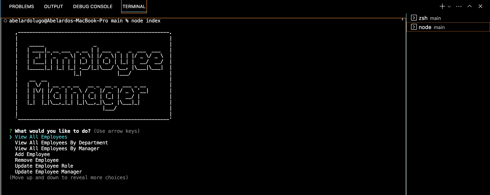

# employee-tracker-sql
  
  ## Licensing: MIT 

  ## Description
    This is a command-line application built from scratch to manage a company's employee database, using Node.js, Inquirer, and MySQL.
    The user is prompted with questions with choices based on what they want to see. 

  ## Table of Contents
  
  -[Installation and Usage](#installation)
  -[Credits](#credits)
  -[License](#license)  
  -[Tech used](#tech-used)

  ## Installation and Usage
  You may download the starter code at https://github.com/ALugo0823/employee-tracker-sql
  The following steps will help you run the app:
  1. In the integrated terminal, enter 'npm i' to install the dependencies from our package.json file
  2. Login to your MySQL by entering 'mysql -u root -p' in the terminal. You will be prompted to enter your password.
  3. Once logged in, we want to USE the database we need, so enter 'USE employees_db' in the terminal.
  3. Next, enter in the terminal 'source db/schema.sql'; 
  4. Now, enter 'quit;' to exit mySQL.
  5. Next, in the terminal enter 'npm start' or 'node index' to initialize the console app.

  Walkthrough video: 
  https://drive.google.com/file/d/1WX7UR5AZxKaKTDfBSJ6a0xzl6PkpXb5h/view

  ## Tech used
  * JavaScript
  * Node.JS
  * SQL2
  * Inquirer package

  ## Credits
  
  - Collaborators: N/A

  ## Questions
  Have any questions or concerns? Here is where you can reach me:
  - Github: alugo0823
  - Email: lugo.kse23@gmail.com
  
  ## Screenshot
  